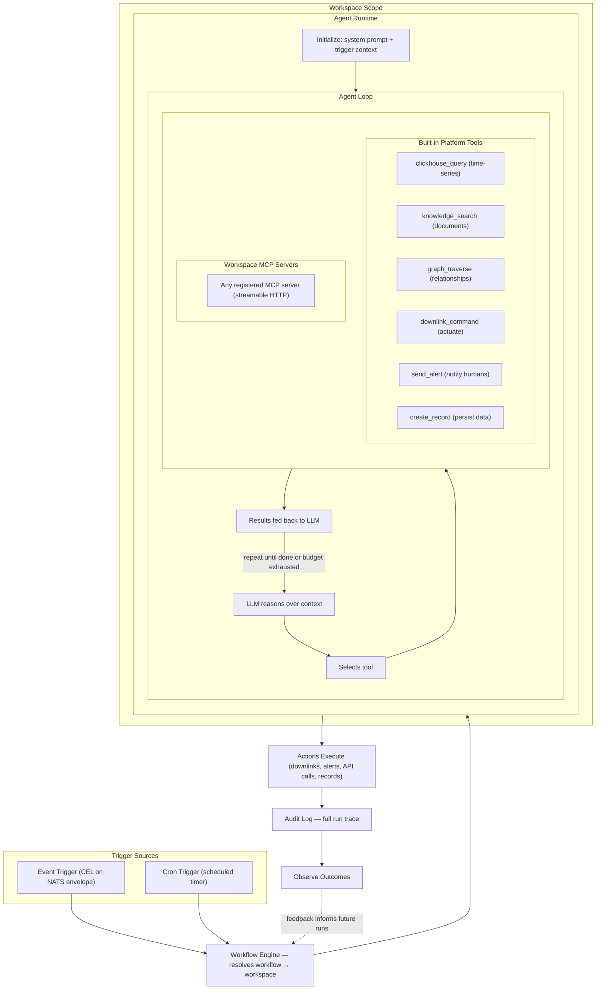

# Roadmap: IoT Data → Agentic Reasoning → Device Downlinks

## Where You Are

One-way pipeline: devices push sensor data through gateways into NATS, CEL expressions transform it, ClickHouse stores it. No way to send commands back. No AI/ML. No document or knowledge management.

## Where You're Going

An agentic system that can observe device data, query historical context, consult documents and entity relationships, call external APIs, make decisions, and send commands back to devices — triggered by real-time events or scheduled jobs.

---

## Phase 1: Harden the Uplink

Make the existing ingest path multi-protocol and production-grade before building on it.

- [x] #36 — Device ownership validation before raw envelope publish
- [x] #122 — Multi-protocol payload contracts — devices aren't locked to one CEL expression
- [ ] #119 — Own the CEL runtime — ability to add IoT-specific functions
- [ ] #120 — Pre-compiled CEL — removes per-message compilation cost at scale
- [ ] #26 — RAKwireless decoder — broader hardware support
- [ ] #94 — Gateway deployer abstraction — decouple gateway lifecycle from in-process `tokio::spawn`
- [ ] #48 — CDC high availability — eliminates single point of failure

> **Why first:** Everything downstream depends on reliable, validated data flowing in. Protocol-agnostic contracts (#122) are especially important — agents will eventually need to reason about devices speaking different protocols, and the downlink path will need protocol-aware encoding.

---

## Phase 2: Knowledge Layer

Give the platform memory beyond raw time-series. Documents, entity relationships, and a graph that represents how the physical world is connected.

- [ ] #102 — AGE + pgvector extensions — graph traversal and vector similarity in PostgreSQL
- [ ] #107 — NATS Object Storage — binary document content storage
- [ ] #106 — Document entity + repository — metadata for manuals, datasheets, config files
- [ ] #108 — Document service + upload — gRPC metadata + HTTP file upload
- [ ] #109 — Document CDC — document lifecycle events in the event stream
- [ ] #110 — Entity relationships — polymorphic links between devices, documents, assets, orgs
- [ ] #111 — Graph sync — CDC events materialize relationships into AGE for traversal

> **Why second:** An agent making device decisions needs context. "Device X is in Building 3, which has HVAC system Y, and the manufacturer's datasheet says the operating range is 10–40°C." That context lives in documents and relationships, not in the time-series.

---

## Phase 3: LLM Integration & Tool Layer

Bring Ollama into the stack and build the two-tier tool layer — built-in platform tools that are always available, and workspace-scoped [MCP](https://modelcontextprotocol.io) servers that extend agent capabilities per workspace.

### Embeddings — Indexing the Knowledge Layer

- [ ] #112 — Ollama + embedding service — local LLM inference and embedding generation
- [ ] #124 — Document embedding pipeline — when a document reaches `ready` status (via CDC), chunk it, embed chunks with `nomic-embed-text`, store vectors in pgvector. Low-volume — documents are created occasionally, not thousands per second
- [ ] #125 — Device definition embedding — embed device definitions and their payload contract descriptions. Semantic search finds the right definitions when the agent needs to understand what a device is and what it reports

### Built-in Platform Tools

These are compiled into the agent runtime and always available on every agent run. They interact with the platform's own data stores and action primitives directly — no network hop, no discovery step. Data access is scoped to the workspace the agent belongs to.

- [ ] #126 — Agent runtime — orchestration loop: receive prompt + context → LLM selects tool(s) → execute → feed results back → LLM reasons again → repeat until terminal action or step limit. Supports multi-step, multi-tool reasoning chains
- [ ] #127 — Agent execution context — scoped per-invocation context carrying workspace ID, org/tenant ID, device scope, and step limits. Built-in tools use this to enforce data boundaries — an agent can only query and act on resources within its workspace

| Built-in Tool | What the Agent Can Do With It |
|---------------|-------------------------------|
| `clickhouse_query` | Query time-series data — last N readings, aggregates, trends, anomaly windows. The agent formulates ClickHouse SQL; results come back as structured data. Scoped to the workspace's devices |
| `knowledge_search` | Semantic search over embedded documents and device definitions via pgvector. "Find the datasheet for this sensor model", "What does the installation manual say about calibration?" Scoped to the workspace's documents |
| `graph_traverse` | Walk the AGE graph — find related devices, assets, org structure, location hierarchy. "What other devices are in the same building?", "Who owns this asset?" Scoped to the workspace's graph |
| `downlink_command` | Submit a downlink command to a device (Phase 4). The agent's primary way to act on the physical world. Scoped to the workspace's devices |
| `send_alert` | Publish an alert/notification — email, webhook, NATS subject, or push notification. Used when the right action is to notify a human rather than actuate a device |
| `create_record` | Write structured data back — create an incident, log a decision, update an entity attribute. Gives the agent persistent side-effects beyond downlinks |

- [ ] #128 — `clickhouse_query` tool implementation
- [ ] #129 — `knowledge_search` tool implementation
- [ ] #130 — `graph_traverse` tool implementation
- [ ] #131 — `downlink_command` tool implementation
- [ ] #132 — `send_alert` tool implementation
- [ ] #133 — `create_record` tool implementation

### Workspace MCP Servers

Additional capabilities are exposed through [MCP](https://modelcontextprotocol.io) servers registered to a workspace. Each workspace maintains a flat list of MCP servers — the platform doesn't care where they're hosted or who built them. When an agent runs, it connects to the workspace's registered servers, discovers their tools via `tools/list`, and calls them via `tools/call` over streamable HTTP. Adding a capability means registering a server; removing one means the agent can no longer use it.

- [ ] #134 — MCP client in agent runtime — the agent runtime speaks MCP natively. On each run, it connects to the workspace's registered MCP servers, discovers tools, and uses `tools/call` during the reasoning loop
- [ ] #135 — Workspace MCP registry — each workspace maintains a list of registered MCP servers (name, endpoint URL, health status). Admins add/remove servers per workspace. The agent executor resolves the registry to live HTTP connections at run start
- [ ] #136 — MCP server management API — CRUD for MCP server registrations per workspace. Health checks. Connection testing

> **Key insight:** The sensor time-series stays in ClickHouse. The agent accesses it through the built-in `clickhouse_query` tool, not embeddings. Vectors are reserved for documents, definitions, and other sparse semantic content where similarity search adds value. Core platform actions (downlinks, alerts, records) are also built-in. MCP servers extend the agent with additional capabilities — the platform treats them all the same regardless of where they're hosted.

---

## Phase 4: Downlink Infrastructure

Build the reverse path — platform to device. This becomes the built-in `downlink_command` tool that agents use to act on the physical world.

- [ ] #137 — Downlink command domain model — `DownlinkCommand` entity with lifecycle states (`Pending → Sent → Acknowledged → Failed`). Repository trait. Migration
- [ ] #138 — Downlink NATS stream — `downlink_commands` stream. Commands flow through the same event infrastructure as uplinks
- [ ] #139 — Downlink gRPC service — manual command submission, status queries, command history
- [ ] #140 — Gateway downlink publishing — extend gateway runners to publish to device MQTT topics. Consume from `downlink_commands` stream, deliver via the appropriate gateway
- [ ] #141 — Downlink encoding — reverse payload conversion — JSON to device-native binary. Mirrors the uplink CEL contracts. Store downlink expressions alongside uplink contracts in `EndDeviceDefinition`

> **Why here and not earlier:** Downlink is useless without something intelligent deciding what to send. But it doesn't need the full autonomous loop to be valuable — manual downlinks via gRPC are useful on their own and let you test the plumbing before agents drive it.

---

## Phase 5: Triggers, Workflows & the Autonomous Loop

Wire the agent runtime to two trigger sources — real-time events from the NATS stream and cron schedules — so agents run autonomously. Workflows are registered to a workspace, inheriting its data scope and MCP servers.

### Trigger Types

| Trigger | How It Fires | Example |
|---------|-------------|---------|
| **Event trigger** | CEL expression evaluated against every processed envelope on the NATS stream. When true, spawns an agent run | `temperature > 38.0 && device.type == "cold_chain"` → agent investigates and decides whether to adjust the compressor or notify a human |
| **Cron trigger** | A cron schedule fires on a timer. No incoming event — the agent starts with a prompt template and assembles its own context via tools | Every day at 06:00 → agent queries overnight readings from ClickHouse, compares against baseline, generates a summary, and sends it via `send-alert`. Every Monday → agent reviews the week's decision outcomes and flags underperforming workflows |

### Workflow Engine

- [ ] #142 — Workflow definition model — a workflow belongs to a **workspace** and binds a **trigger** (event CEL / cron expression) to an **agent configuration** (system prompt template). Because the workflow belongs to the workspace, the agent automatically inherits the workspace's data scope (built-in tools) and registered MCP servers. Stored as a first-class entity with CRUD + CDC
- [ ] #143 — Cron scheduler — persistent cron registry backed by PostgreSQL. Evaluates cron expressions, publishes trigger events to NATS on schedule. Survives restarts. Distributed-lock-safe for HA
- [ ] #144 — Agent executor service — consumes trigger events from NATS, hydrates the workflow config, resolves the workflow's workspace (MCP registry + data scope), initializes the agent runtime, and manages the execution lifecycle (timeout, retries, step budgets)
- [ ] #145 — Workflow audit log — every agent run is recorded: trigger source, workspace, tools called (with inputs/outputs), LLM reasoning trace, final actions taken, and outcome. Stored in ClickHouse for analysis
- [ ] #146 — Workflow management API — CRUD for workflows within a workspace. Enable/disable triggers. View run history, MCP tool usage breakdown

---

## Phase 6: LoRaWAN / ChirpStack

Add first-class LoRaWAN support via ChirpStack integration — both uplink and downlink. This is a new `EndDeviceDefinition` type that plugs into the existing ingest, downlink, and agent infrastructure built in earlier phases.

### Uplink

- [ ] #147 — ChirpStack `EndDeviceDefinition` type — a new device definition type representing ChirpStack-managed LoRaWAN devices. Carries ChirpStack-specific metadata: application ID, device profile, device EUI, and payload codec configuration
- [ ] #148 — ChirpStack uplink ingest — subscribe to ChirpStack's event stream (MQTT or gRPC integration), receive uplink events, map them to the platform's envelope format. Feeds into the same NATS → CEL → ClickHouse pipeline as all other devices
- [ ] #149 — ChirpStack payload contracts — CEL expressions (or ChirpStack's built-in codec output) for decoding LoRaWAN payloads. Stored on the `EndDeviceDefinition` alongside the standard uplink contracts

### Downlink

- [ ] #150 — ChirpStack downlink routing — when a `DownlinkCommand` targets a ChirpStack device, route it through ChirpStack's downlink API (enqueue) instead of direct MQTT publish. The downlink infrastructure from Phase 4 handles lifecycle tracking — ChirpStack handles the LoRaWAN Class A/B/C scheduling
- [ ] #151 — ChirpStack downlink encoding — reverse payload conversion for LoRaWAN devices. Store downlink encoding expressions on the ChirpStack `EndDeviceDefinition`. The `downlink_command` built-in tool uses these to encode the agent's JSON payload into the binary format ChirpStack expects

> **Why last:** The full platform — ingest, knowledge layer, agent runtime, downlink infrastructure, and workflow engine — needs to be solid before adding a new protocol integration. ChirpStack support is additive: it's a new `EndDeviceDefinition` type that plugs into every layer, not a rearchitecture. Doing it last means the abstractions are proven and the integration is straightforward.

---

## The Full Loop

---

## Open Questions to Resolve Along the Way

- **Where does new code live?** Each phase will naturally suggest boundaries, but no need to decide crate structure upfront.
- **Ollama vs. external LLM?** #112 starts with Ollama for local inference, but the agent runtime's LLM interface should be provider-agnostic.
- **Cron scheduling at scale** — single scheduler with distributed lock, or sharded? Depends on how many concurrent workflows tenants define.
- **Agent step limits & cost control** — how many tool calls per run? How do you prevent an agent from looping? Token budgets, step caps, and wall-clock timeouts all need sensible defaults.
- **Additional protocol support** — after ChirpStack, CoAP and other network servers each have their own uplink/downlink semantics — handle via additional `EndDeviceDefinition` types as needed.
- **Multi-tenant isolation** — do orgs share a model, or does each get their own? Workspace scoping handles tool and data boundaries, but model sharing is a separate question.
